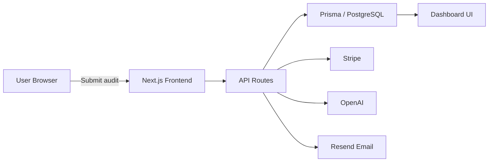

# Architecture

## System Overview
AI Spend Audit is built as a full-stack SaaS application using Next.js App Router, Prisma ORM, PostgreSQL, Stripe billing, and OpenAI for advanced insights.

## Key components
- **Frontend:** Next.js + Tailwind CSS delivers the landing page, audit form, dashboard, and team management UI.
- **Authentication:** NextAuth v5 provides OAuth sign-in with Google and GitHub.
- **Backend API:** App Router API routes handle audits, analytics, organizations, billing, and notifications.
- **Database:** Prisma models users, organizations, audits, subscriptions, notifications, and audit logs.
- **Billing & Payments:** Stripe manages checkout, portal, and webhook events for subscription lifecycle.
- **AI Integration:** OpenAI generates optimization insights, summaries, consolidation suggestions, and ROI analysis.
- **Notifications:** In-app notifications and email digests keep teams informed.

## Data flow
1. User submits an audit form on the landing page.
2. The frontend sends the audit payload to `/api/audits`.
3. The audit service validates, stores, and calculates initial results.
4. AI insight endpoints optionally call OpenAI for enhanced recommendations.
5. Results are stored in the database and surfaced in the dashboard.
6. Stripe handles subscription creations and updates via `/api/stripe/webhook`.

## Diagram

## Deployment
The app is deployed on Vercel with environment variable validation in `lib/env.ts`. The database is intended to run on PostgreSQL-compatible providers like Neon, Supabase, or Aiven.
